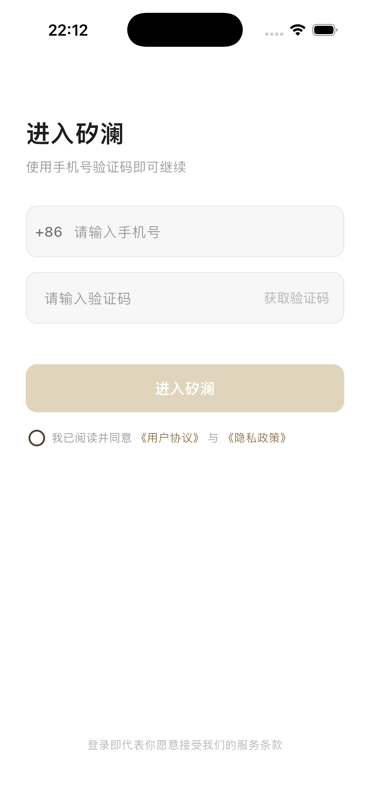
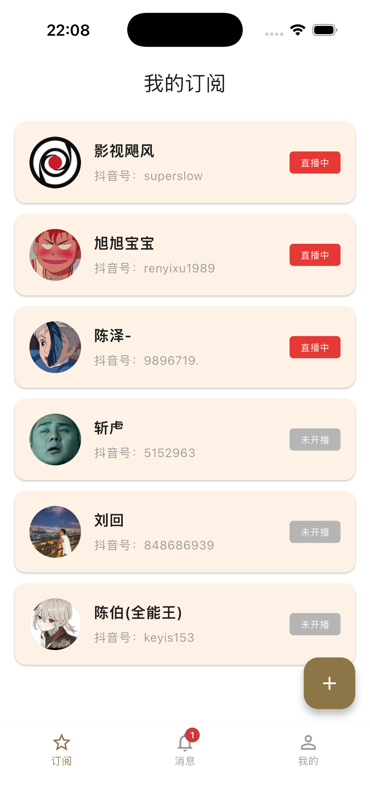
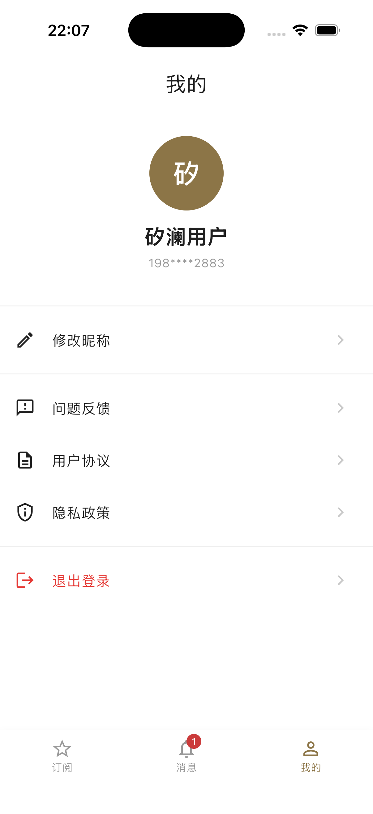
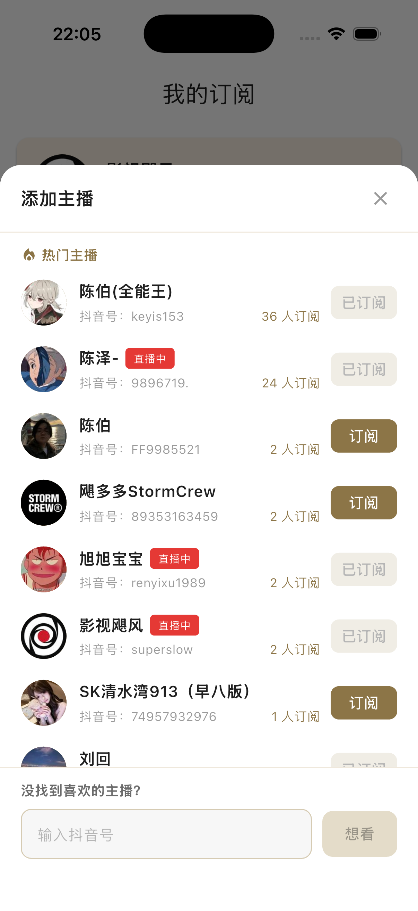
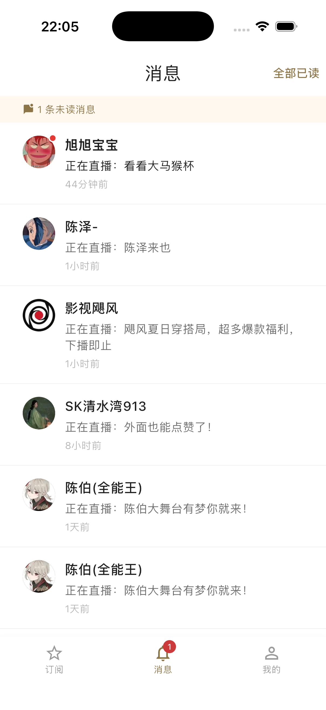

# si_land_client

矽澜（si_land）移动端 App，基于 Flutter 构建。订阅你关注的抖音主播，开播第一时间收到通知，不再错过喜欢的直播。

配套项目：[si_land_server](https://github.com/waitstudio/si_land_server)（Rust 后端） / [si_land_admin](https://github.com/waitstudio/si_land_admin)（管理后台）。

## 界面预览

<p align="center">

</p>

## 功能特性

### 登录
- 手机号验证码登录，自动校验手机号格式与验证码位数
- 验证码 60 秒重发倒计时
- 用户协议与隐私政策查看

### 主播订阅
- 订阅列表：展示已订阅主播的开播状态，收到开播通知后自动置顶并更新「直播中」标签
- 检测开播：对单个主播发起实时开播检测
- 批量轮询：一键检测全部订阅主播的开播状态
- 添加订阅：从热门主播列表（按人气排序，最多 100 名）中挑选订阅
- 想看意愿：列表中没有的主播，可提交抖音号表达「想看」，推动主播入选
- 取消订阅

### 实时通知
- WebSocket 长连接：开播后秒级收到通知
- 应用内顶部弹窗：点击直达消息页，同屏最多展示一条，自动去重防重复弹窗
- 全局未读红点：乐观更新 + 服务端权威校准，展示封顶 99+
- 断线自动重连：指数退避（1s → 60s 封顶），应用回到前台立即重连
- 切后台时抑制弹窗，回前台正常展示

### 消息中心
- 开播通知列表：主播头像、通知内容、相对时间（刚刚 / N 分钟前，实时跳变）
- 未读总数横幅 + 一键全部已读
- 单条点击标为已读、左滑删除
- 下拉刷新、上拉分页加载

### 我的
- 个人信息展示
- 问题反馈提交
- 用户协议与隐私政策

## 技术栈

Flutter · provider（MVVM）· WebSocket · Material 3（白底金色设计语言）

## 运行流程

环境要求：Flutter（Dart SDK ^3.12）；需先启动 [si_land_server](../si_land_server)。

```bash
# 1. 安装依赖
flutter pub get

# 2. 运行（按运行目标指定后端地址）
# iOS 模拟器（本机后端）
flutter run --dart-define=BASE_URL=http://127.0.0.1:8080
# Android 模拟器（宿主机后端需用 10.0.2.2）
flutter run --dart-define=BASE_URL=http://10.0.2.2:8080
# 真机调试（替换为本机局域网 IP）
flutter run --dart-define=BASE_URL=http://192.168.1.100:8080

# 3. 测试
flutter test
```

登录：输入 11 位手机号获取验证码。开发环境后端默认固定验证码 `1234`（由 `MOCK_FIXED_CODE` 配置）。

## 免责声明

1. 本项目**仅供个人学习与技术研究用途**，严禁用于任何商业用途或违法违规用途。
2. 本项目涉及对第三方平台（抖音）数据的访问与解析，相关实现仅用于技术研究演示。使用者应遵守抖音平台的相关服务条款，不得对平台服务造成干扰或滥用其接口。
3. 本项目不提供任何明示或默示的保证，不对数据的准确性、完整性与时效性作任何承诺。使用者因使用本项目产生的任何直接或间接损失，作者不承担任何责任。
4. 开播状态、主播信息等数据版权归原平台及主播所有。若相关权利人认为本项目侵犯了其合法权益，请通过 Issue 联系，核实后将及时处理。
5. 使用本项目产生的任何行为与后果，均由使用者本人承担。请在使用前了解并遵守您所在地区及目标平台适用的法律法规。
